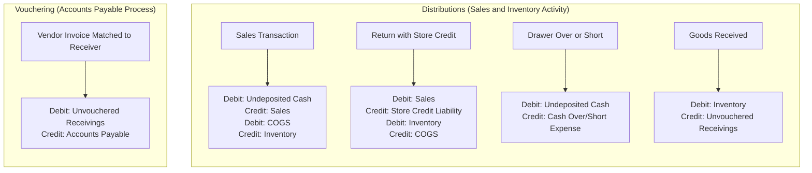

# Rapid POS Unified Accounting Connector
Updated June 17th 2026

The Rapid POS Unified Accounting Connector automates the synchronization of sales, tender, and inventory data between CounterPoint and your accounting system — reducing manual data entry and improving financial accuracy.

> **Note:** This integration assumes a solid understanding of accounting and bookkeeping principles. Without that foundation, the connector may feel complex or introduce confusion into your financial processes. Review the [Accounting Knowledge Self-Assessment](#section-1-accounting-knowledge-self-assessment) before proceeding.

---

## Overview

The Unified Accounting Connector eliminates manual financial data entry by pushing sales, tenders, cost of goods sold, inventory adjustments, and accounts payable directly from CounterPoint into your accounting platform. It is continuously maintained and deployed through Rapid's CI/CD pipeline, meaning updates are delivered automatically with no manual reinstalls required.

👉 [Release Notes & Documentation](https://github.com/Rapid-POS)

---

## Supported Accounting Platforms

- QuickBooks Desktop
- QuickBooks Online
- Sage Intacct *(CI/CD deployment coming soon)*

---

## System Requirements

| Requirement | Minimum Version |
|-------------|----------------|
| **CounterPoint** | 8.5.6.2 |
| **SQL Server** | 2016 |
| **Windows Server** | 2016 |
| **PowerShell** | 5.1 |

> [!WARNING]
> Your environment must meet our [CI/CD Connector Requirements](https://github.com/Rapid-POS/Miscellaneous-Documents/blob/main/CICD-Connector-Requirements.md) (server access, firewall rules, etc.) before any install or upgrade. Troubleshooting, manual installs, or follow-up work resulting from unmet requirements will be billed at standard T&M rates.

If your system does not meet these minimum requirements, please consult your Care Team Lead (vCIO) for an upgrade quote.

---

## Table of Contents

- [CI/CD Deployment Model](#cicd-deployment-model)
- [Minimum Knowledge Requirements](#minimum-knowledge-requirements)
- [Section 1: Accounting Knowledge Self-Assessment](#section-1-accounting-knowledge-self-assessment)
- [Section 2: Connector Overview](#section-2-connector-overview)
- [Section 3: Transaction Responsibilities](#section-3-transaction-responsibilities)
- [Section 4: Integration Frequency Options](#section-4-integration-frequency-options)
- [Section 5: Costs and Pricing](#section-5-costs-and-pricing)
- [Conclusion](#conclusion)

---

## CI/CD Deployment Model

Starting in 2024, Rapid transitioned its connectors to a **CI/CD (Continuous Integration / Continuous Deployment)** model. This modern approach ensures your connector is continuously updated, more reliable, and future-proof.

### What You Get

With a CI/CD connector, you receive:

- **Automatic bug fixes** — issues are often resolved before you notice them
- **Automatic feature enhancements** — new capabilities are delivered as they become available
- **Compatibility updates** — when third-party platforms change their APIs or systems, Rapid can deploy fixes before your business is affected
- **Reduced downtime** — fewer disruptions, fewer maintenance windows
- **Predictable monthly pricing** — no surprise labor charges for individual updates

### How It Used to Work

Previously, every bug fix or new feature had to be manually reinstalled for each client that requested it. This meant labor billed at Rapid's standard hourly rate, delays while updates were rolled out individually, and unexpected costs with little advance notice. CI/CD eliminates this cycle — updates are deployed automatically across all clients with no reinstall required.

### What Your Subscription Supports

CI/CD connectors are actively maintained products, not one-time software installations. Your subscription funds:

- New features and functionality
- Ongoing maintenance, bug fixes, and performance improvements
- Compatibility updates when third-party platforms change their APIs or systems
- Infrastructure required for automated deployments

This ensures every client benefits from improvements as they are released — not just those who ask.

### Deployment Notifications and Release Notes

Rapid will attempt to provide at least 24 hours' notice prior to scheduled connector upgrades, along with an estimated deployment window. In rare circumstances, an important update may need to be deployed on short notice or without notice.

Release notes and version history for all CI/CD connectors are available on GitHub:
👉 [https://github.com/Rapid-POS](https://github.com/Rapid-POS)

---

## Minimum Knowledge Requirements

Before implementing the Accounting Connector, you or your financial lead should understand:

- Debits and credits
- Clearing accounts
- Bank deposit reconciliation
- Contra accounts
- Basic journal entries

If these concepts are unfamiliar, consider working with your accountant or using manual processes until your foundation is stronger.

---

## Section 1: Accounting Knowledge Self-Assessment

### Should You Connect CounterPoint to Your Accounting System?

Connecting CounterPoint to a financial system is not the right choice for every business. This decision should be based on your store's processes, preferences, and level of accounting expertise.

### Manual vs. Automated Approaches

Some retailers prefer a **manual workflow**, which may include running reports from CounterPoint, sending those reports to an accountant, and entering summary data manually into their accounting system. CounterPoint fully supports this approach by providing the necessary reporting tools.

### When Integration Adds Value

If you or your financial lead have a solid understanding of accounting and bookkeeping principles, the Accounting Connector can provide significant benefits:

- Reduced manual data entry
- Improved accuracy
- Better financial visibility
- More timely reporting

### When to Proceed with Caution

If your accounting foundation is limited, the connector may feel intimidating, difficult to manage, or frustrating to troubleshoot. In these cases, a manual approach may produce better results until your processes and knowledge are more developed.

### Self-Assessment Questions

Use the following questions to evaluate your readiness before proceeding with implementation.

---

**Q1: Clearing Account Transactions**

When a sale occurs, a credit is recorded in sales and a debit in an undeposited tender account. What happens when funds are deposited?

- Debit: Cash account
- Credit: Undeposited tender account

This clears the transaction from the clearing account.

---

**Q2: Purpose of Clearing Accounts**

Clearing accounts provide a control point. Any remaining balance highlights discrepancies between expected and actual deposits, enabling reconciliation.

---

**Q3: Contra Accounts**

A contra account carries an opposite balance to its classification.

**Example:** Merchandise returns tracked separately from sales, enabling clearer financial reporting.

---

**Q4: Cash Drawer Shortage**

- Debit: Cash Over/Short Expense
- Credit: Undeposited Cash

---

**Assessment Summary**

If these concepts are well understood, the connector can provide strong value. If not, consider using CounterPoint reports and manually entering data into your accounting system until your accounting foundation is stronger.

---

## Section 2: Connector Overview

The Accounting Connector consists of two primary components.

### 1. Vendor Payables (Vouchering Receivers)

Merchandise receipts entered in CounterPoint generate **accounts payable entries** in your accounting system (e.g., QuickBooks).

### 2. General Ledger (Distributions)

CounterPoint pushes the following data to your accounting system:

- Sales
- Tenders
- Cost of Goods Sold (COGS)
- Inventory adjustments
- Inventory value

### Accounting Flow Overview

---

## Section 3: Transaction Responsibilities

To ensure accurate financial reporting, you and your bookkeeper must clearly understand which system is responsible for each type of transaction. The Accounting Connector is designed to automate the flow of key financial data into your accounting system while maintaining a clear separation of responsibilities between systems.

Refer to your Rapid POS representative for a full transaction responsibility matrix covering what CounterPoint manages, what the connector automates, and what must be handled directly in your accounting system.

---

## Section 4: Integration Frequency Options

You can control how often data is synchronized between CounterPoint and your accounting system.

### Common Options

- 3 times per day
- Daily
- Weekly
- Monthly

### Considerations

When choosing a frequency, consider your transaction volume, reporting needs, and reconciliation processes. Higher-volume stores typically benefit from more frequent syncs to keep financial data current and reduce end-of-period reconciliation effort.

---

## Section 5: Costs and Pricing

### General Notes

- Rapid does **not sell accounting software** — accounting software must be sourced separately
- Rapid supports the connector only, not accounting system usage
- No third-party tools are required

### Baseline Pricing (Single Location)

| Platform | Setup | Monthly |
|---|---|---|
| QuickBooks Desktop | $999.00 | $65.00/mo |
| QuickBooks Online | $999.00 | $65.00/mo |
| Sage Intacct | $2,800.00 | $65.00/mo |

### Additional Options

| Option | Cost |
|---|---|
| Custom Chart of Accounts | $624.00 |
| Category / Subcategory / Multi-Location | $468.00 |
| Align Account Codes (up to 20) | $624.00 |

> Additional account configuration is billed at standard hourly rates.

---

## Conclusion

The Rapid POS Unified Accounting Connector streamlines financial workflows by automating data transfer between CounterPoint and your accounting system. Successful implementation depends on a solid accounting foundation, clear process ownership, and proper configuration.

**Key benefits:**

- Reduced manual data entry
- Improved accuracy
- Better financial visibility
- Continuous updates through CI/CD — no manual reinstalls

Before go-live, complete the self-assessment in Section 1, confirm your environment meets the system requirements, and review transaction responsibilities with your bookkeeper or accountant.

For assistance with setup, evaluation, or configuration, contact Rapid Support.

