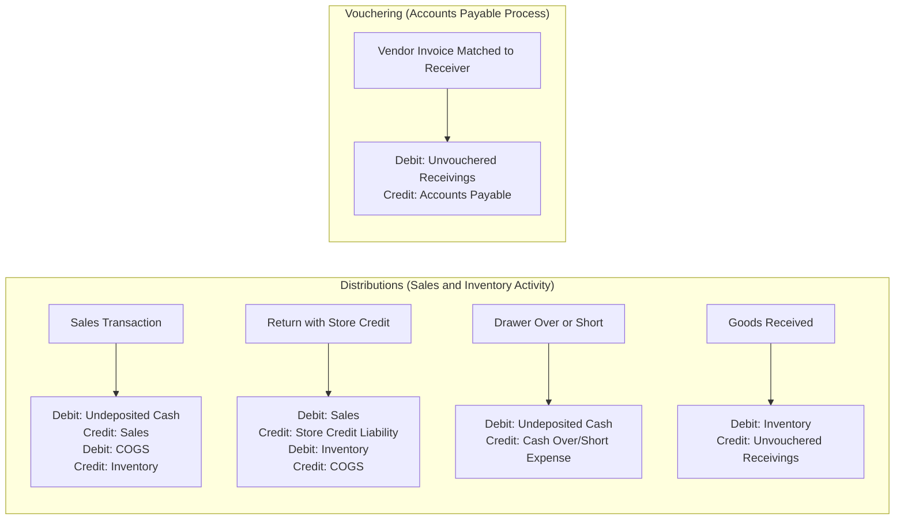

# Rapid POS Unified Accounting Connector Guide  
**Updated: 03/31/2026**

---

## Overview

The **Rapid POS Unified Accounting Connector** automates the synchronization of sales, tender, and inventory data between Counterpoint and your accounting system—reducing manual data entry and improving financial accuracy.

While this integration provides significant value, it assumes a solid understanding of accounting and bookkeeping principles. Without that foundation, the connector may feel complex or introduce confusion into your financial processes.

This guide will help you:
- Understand what the connector does
- Explain the CI/CD Deployment Model
- Evaluate whether it is the right fit for your business  
- Prepare for a successful implementation  

---

## Supported Accounting Platforms

- QuickBooks Desktop  
- QuickBooks Online  
- Sage Intacct *(CI/CD deployment coming soon)*  

---

## Minimum System Requirements:
- Minimum Counterpoint version: **8.5.6.2**  
- Minimum SQL Server version: **2016**  
- Minimum Windows Server version: **2016**  
- Minimum PowerShell version: **5.1**
  
---

## Table of Contents

- Minimum Knowledge Requirements  
- CI/CD Deployment Model  
- SECTION 1: Accounting Knowledge Self-Assessment  
- SECTION 2: Connector Overview  
- SECTION 3: Transaction Responsibilities  
- SECTION 4: Integration Frequency Options  
- SECTION 5: Connection Levels  
- SECTION 6: Costs and Pricing  
- Conclusion  

---

## Minimum Knowledge Requirements

Before implementing the Accounting Connector, you or your financial lead should understand:

- Debits and credits  
- Clearing accounts  
- Bank deposit reconciliation  
- Contra accounts  
- Basic journal entries  

If these concepts are unfamiliar, consider working with your accountant or using manual processes until your foundation is stronger.

---

## CI/CD Deployment Model

### Overview

Starting in 2024, Rapid transitioned its connectors to a **CI/CD (Continuous Integration / Continuous Deployment)** model.

This modern approach ensures your connector is continuously updated, more reliable, and future-proof.

---

### What is CI/CD?

CI/CD allows updates to be:

- Automatically tested and validated  
- Seamlessly deployed to all clients  
- Delivered continuously without manual intervention  

Your connector always runs the latest, most stable version.

---

### Benefits

#### Automatic Updates
- No manual reinstallations required  
- New features and bug fixes deployed automatically  
- Issues often resolved before impacting your system  

#### Reduced Costs and Friction
- Eliminates billable update labor (previously $156/hour)  
- Removes unpredictable upgrade costs  
- Faster and more consistent rollout of improvements  

#### Improved Reliability
- Rapid response to bugs and third-party changes  
- Ongoing performance enhancements  
- Reduced downtime  

---

### Updated Billing Model

To support CI/CD, connectors are now billed on a **monthly subscription basis**.

#### Key Advantages

**Predictable Costs**
- No surprise fees for required updates  

**Fair Pricing**
- Shared investment across all clients  

**Lower Long-Term Costs**
- Economies of scale as adoption grows  

**Continuous Improvement**
- Ongoing investment in features, support, and performance  

---

### Deployment Notifications

Before any update is deployed:

- You will receive **at least 24 hours advance notice via email**
- Notifications include:
  - Deployment timing  
  - Summary of changes  
  - Link to release notes  

---

### Release Notes & Documentation

View current connector documentation and release notes:

👉 https://github.com/Rapid-POS

---

## SECTION 1: Accounting Knowledge Self-Assessment

## Should You Connect Counterpoint to Your Accounting System?

Connecting Counterpoint to a financial system is not the right choice for every business. This decision should be based on your store’s processes, preferences, and level of accounting expertise.

### Manual vs. Automated Approaches

Some retailers prefer a **manual workflow**, which may include:
- Running reports from Counterpoint
- Sending those reports to an accountant
- Entering summary data manually into their accounting system  

Counterpoint fully supports this approach by providing the necessary reporting tools.

---

### When Integration Adds Complexity

For some businesses, connecting Counterpoint directly to an accounting platform introduces a higher level of accounting structure and discipline than currently exists.

Depending on your organization, this can be:
- A **positive step forward** toward more sophisticated financial tracking  
- Or an **unnecessary complication** that adds confusion and overhead  

---

### When Integration Adds Value

If you or your financial lead have a solid understanding of accounting and bookkeeping principles, the Accounting Connector can provide significant benefits:

- Reduced manual data entry  
- Improved accuracy  
- Better financial visibility  
- More timely reporting  

---

### When to Proceed with Caution

If your accounting foundation is limited, the connector may feel:
- Intimidating  
- Difficult to manage  
- Frustrating to troubleshoot  

In these cases, a manual approach may produce better results until your processes and knowledge are more developed.

---

### Next Step: Self-Assessment

To help determine whether the Accounting Connector is the right fit for your store, review the following questions and answers. These are designed to assess your understanding of key bookkeeping concepts and guide your decision.
Use the following questions to evaluate your readiness.

---

### Q1: Clearing Account Transactions

**Question:**  
When a sale occurs, a credit is recorded in sales and a debit in an undeposited tender account. What happens when funds are deposited?

**Answer:**
- Debit: Cash account  
- Credit: Undeposited tender account  

This clears the transaction from the clearing account.

---

### Q2: Purpose of Clearing Accounts

**Answer:**
Clearing accounts provide a control point. Any remaining balance highlights discrepancies between expected and actual deposits, enabling reconciliation.

---

### Q3: Contra Accounts

**Answer:**
A contra account carries an opposite balance to its classification.

**Example:**
- Merchandise returns tracked separately from sales  
- Enables clearer financial reporting  

---

### Q4: Cash Drawer Shortage

**Answer:**
- Debit: Cash Over/Short Expense  
- Credit: Undeposited Cash  

---

### Assessment Summary

If these concepts are understood, the connector can provide strong value.

If not, consider:
- Using Counterpoint reports  
- Manually entering data into your accounting system  

---

## SECTION 2: Connector Overview 

## Core Connector Functions

The Accounting Connector consists of two primary components:

### 1. Vendor Payables (Vouchering Received Purchase Orders)

- Merchandise receipts entered in Counterpoint generate **accounts payable entries** in your accounting system (e.g., QuickBooks)

---

### 2. General Ledger (Distributions)

Counterpoint automatically sends the following data to your accounting system:

- Sales  
- Tenders  
- Cost of Goods Sold (COGS)  
- Inventory adjustments  
- Inventory value  
   

---

## Accounting Flow Overview: Distributions and Vouchering from Counterpoint to Accounting Application

Transaction Responsibilities

## Transaction Responsibilities: Counterpoint vs. Accounting System

To ensure accurate financial reporting, it is important that you and your bookkeeper clearly understand which system is responsible for each type of transaction.

---

### Overview

The Counterpoint Accounting Connector is designed to automate the flow of key financial data into your accounting system while maintaining a clear separation of responsibilities between systems.

---

---

## ## SECTION 4: Integration Frequency Options

You can control how often data is synchronized between Counterpoint and your accounting system.

### Common Options

- 3 times per day  
- 1 time per day  
- Weekly  
- Monthly  

Choose a frequency that aligns with your:
- Transaction volume  
- Reporting needs  
- Reconciliation process  

---

## SECTION 4: Integration Frequency Options

Configure how often data syncs between systems.

### Common Options:
- 3 times per day  
- Daily  
- Weekly  
- Monthly  

**Consider:**
- Transaction volume  
- Reporting needs  
- Reconciliation processes  

---

## SECTION 5: Connection Levels

Counterpoint supports multiple integration levels.

### Available Option:
- **None**
  - No automated integration  
  - Fully manual accounting process
  - Using the Unified Accounting Connector to automate the data transfer

*(Additional levels may be available depending on configuration.)*

---

## SECTION 6: Costs and Pricing

### General Notes

- Rapid does **not sell accounting software**  
- Accounting software must be sourced separately  
- Rapid supports the connector only (not accounting system usage)  
- No third-party tools are required  

---

### Baseline Pricing (Single Location)

#### QuickBooks (Desktop or Online)
- Setup: **$999**  
- Monthly: **$65**

#### Sage Intacct
- Setup: **$2,800**  
- Monthly: **$65**

---

### Additional Options

| Option | Cost |
|------|------|
| Custom Chart of Accounts | $624 |
| Category / Subcategory / Multi-Location | $468 |
| Align Account Codes (up to 20) | $624 |

> Additional account configuration billed at standard hourly rates.

---

## Conclusion

The Rapid POS Unified Accounting Connector streamlines financial workflows by automating data transfer between Counterpoint and your accounting system.

However, successful implementation depends on:

- A solid accounting foundation  
- Clear process ownership  
- Proper configuration  

### Key Benefits

- Reduced manual data entry  
- Improved accuracy  
- Better financial visibility  
- Continuous updates through CI/CD  

---

For assistance with setup, evaluation, or configuration, contact **Rapid Support**.

